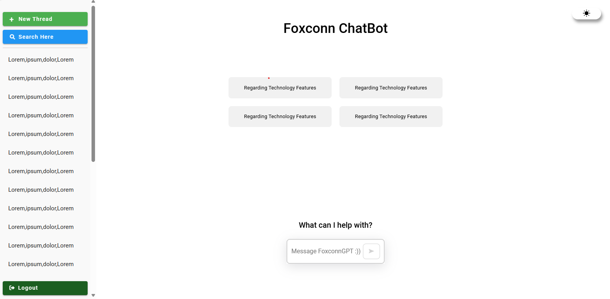
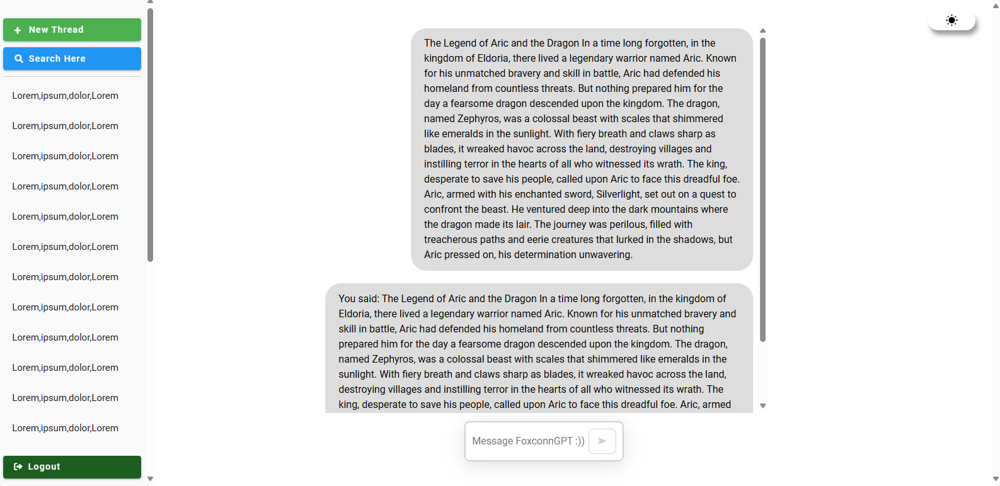
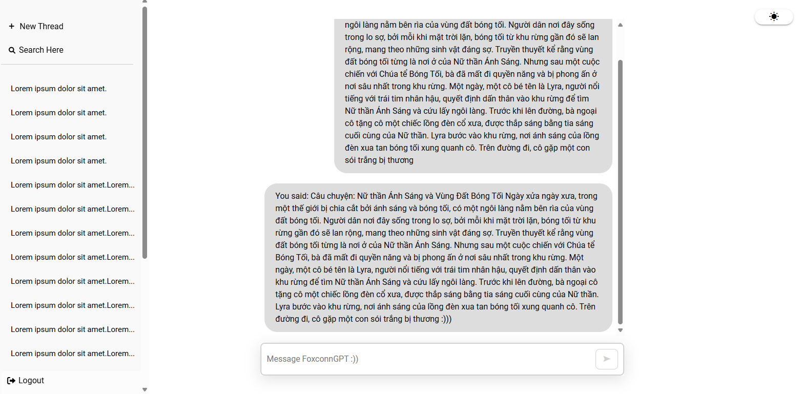

# my-vue-app

## Project setup
```
npm install
```

### Compiles and hot-reloads for development
```
npm run serve
```
## The interface of Chatbot can be look like below, any changes will be updated later 😊
The basic interface:

The chat interface:

The Search bar interface:

The basic interface with darkmode:

