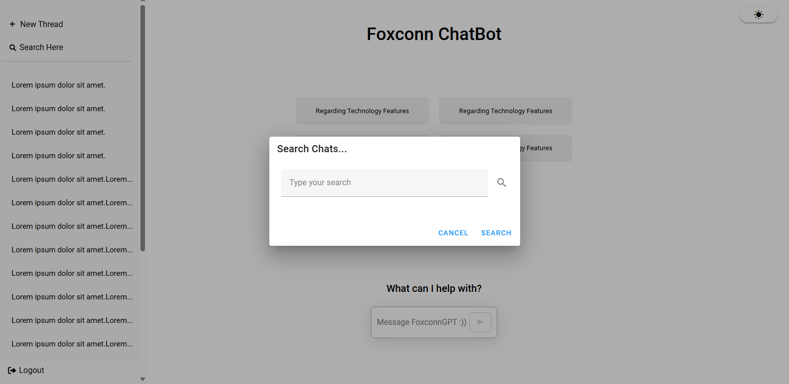
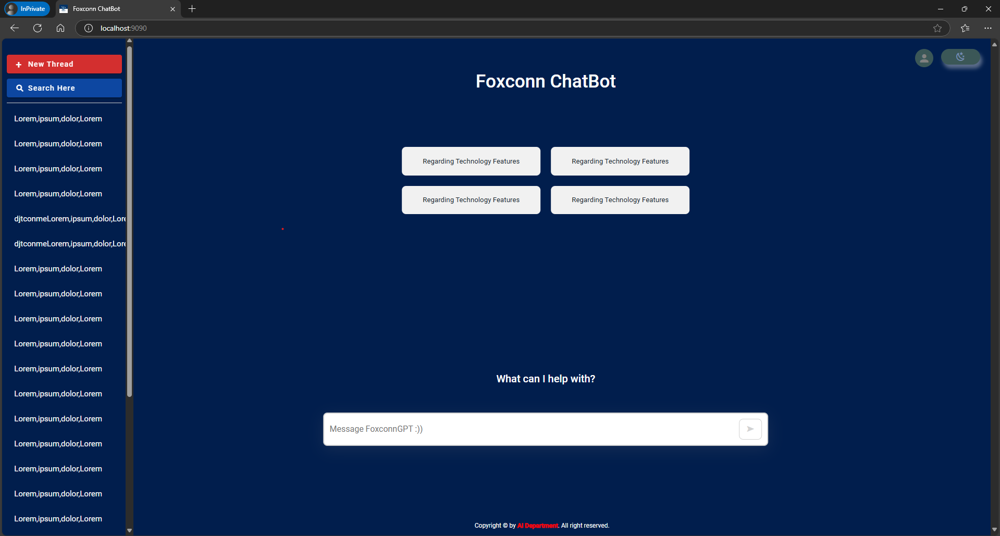

# my-vue-app

## Project setup
```
npm install
```

### I also use router with npm, so you should install router from vue-router too. 
```
npm install vue-router@latest
```

### Compiles and hot-reloads for development
```
npm run serve
```

## In this app, you gotta login to your account to access the Chatbot homepage. If you try to access the homepage link while not logged in, you will still be redirected to the login page!

## You can create a new message by creating a new chat and then pasting that message into the newly created chat.

## The interface of Chatbot can be look like below, any changes will be updated later 😊

The Login page:


The homepage:


The chat:


The Search bar:


The basic with darkmode:

