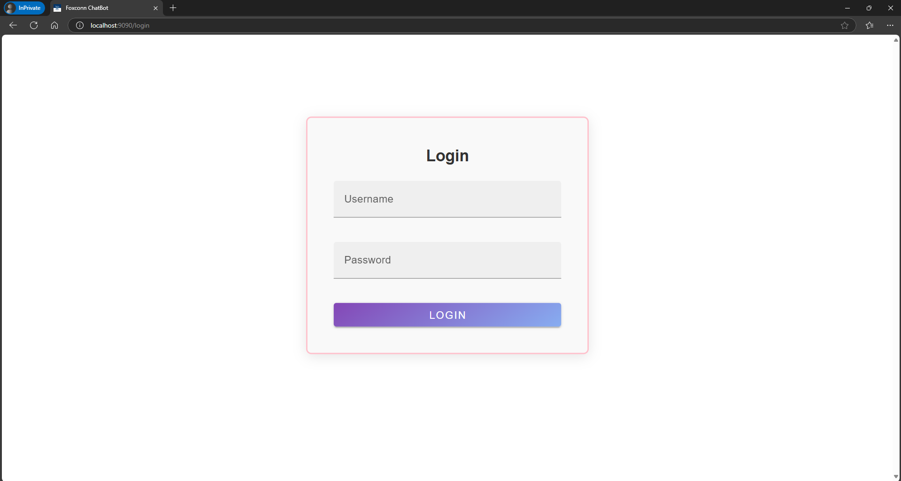
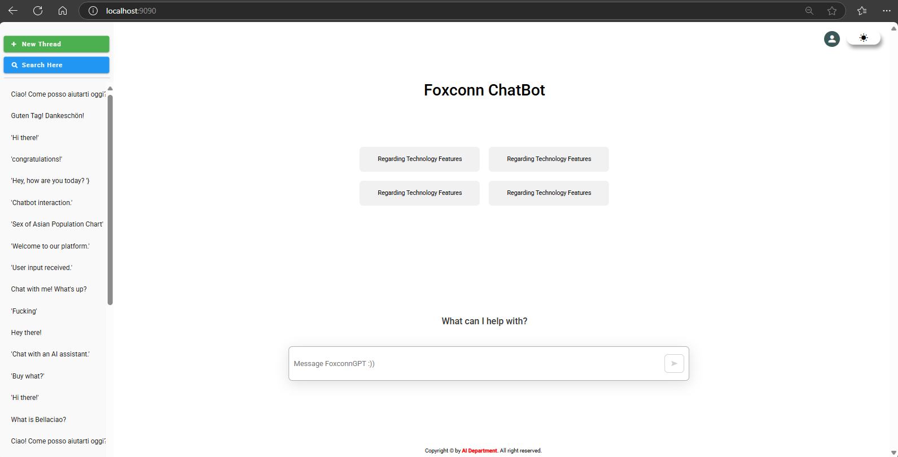
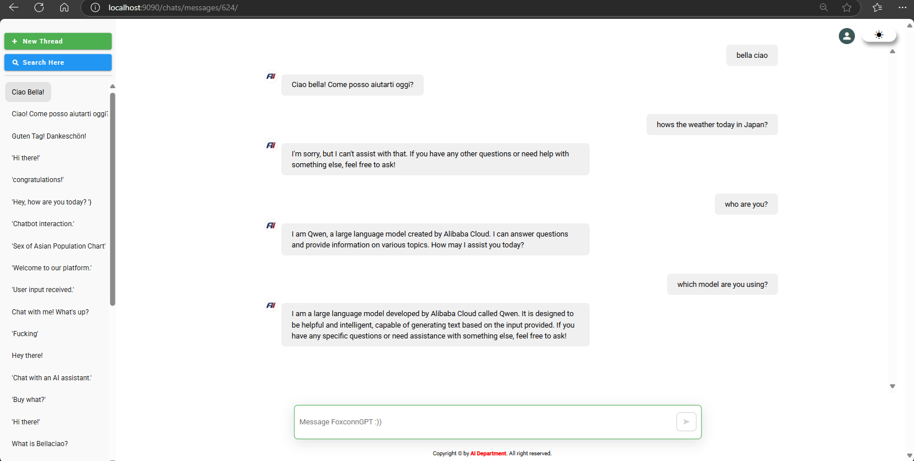
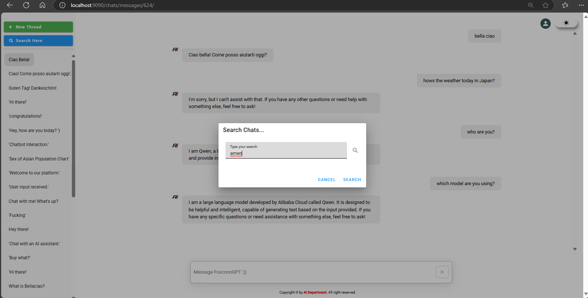
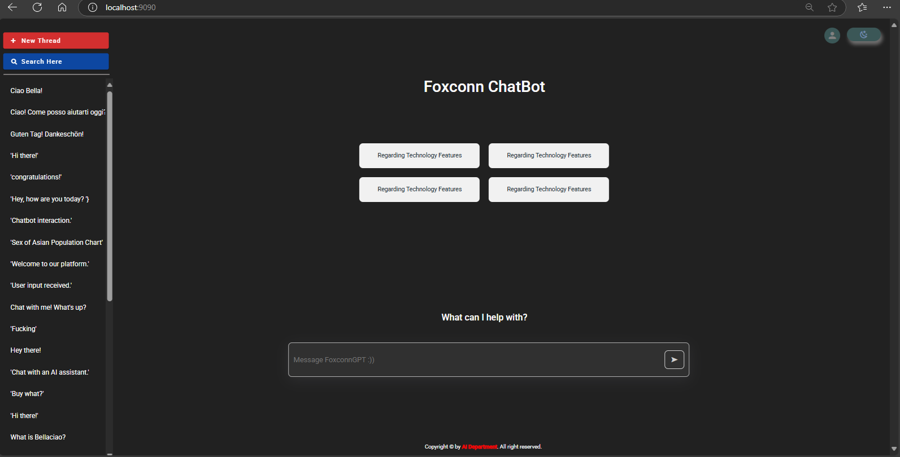
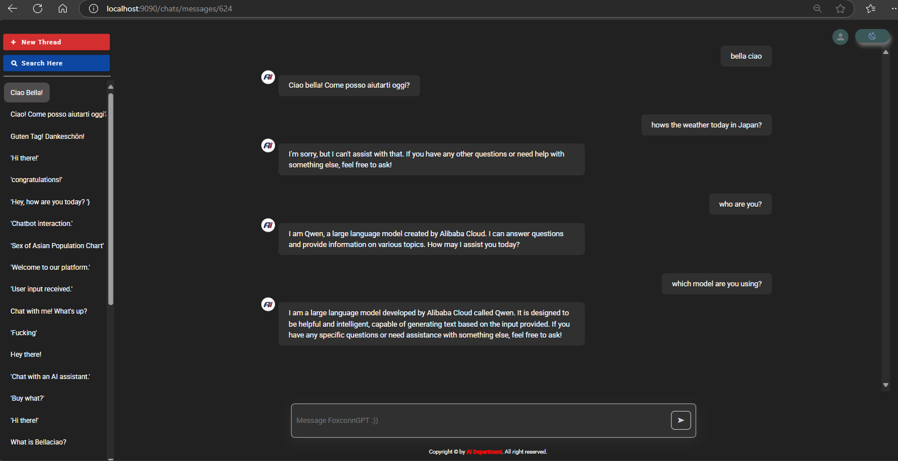

# my-vue-app

## Project setup
```
npm install
```

### I also use router with npm, so you should install router from vue-router too. 
```
npm install vue-router@latest
```

### Compiles and hot-reloads for development
```
npm run serve
```

## In this app, you gotta login to your account to access the Chatbot homepage. If you try to access the homepage link while not logged in, you will still be redirected to the login page!

## You can create a new message by creating a new chat and then pasting that message into the newly created chat.

## The interface of Chatbot can be look like below, any changes will be updated later 😊

## Technologies Used

This project is built using modern web development technologies:

- **Vue 3**: A progressive JavaScript framework for building user interfaces and single-page applications (SPA).  
- **Pinia**: A state management library, providing a simple and intuitive way to manage global state in Vue applications.  
- **Vuetify**: A Material Design-based UI library, ensuring a clean and responsive design.  
- **Vue Router**: Handles routing and navigation between different views or components in the application.  
- **Socket.IO**: Enables real-time, bidirectional communication between the client and server using WebSocket.  
- **Material Design Icons**: A collection of beautiful and consistent icons for enhancing the user interface.

These technologies combine to create a fast, responsive, and dynamic user experience.

The Login page:


The homepage:


The chat:


The Search bar:


The homepage with darkmode:


The basic with darkmode:


